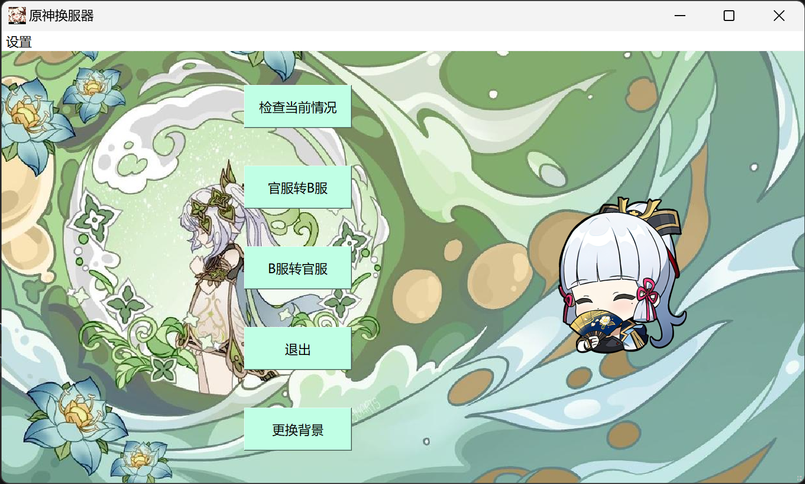

    

<h1 align="center">
Server Changer for Genshin 

</h1>

## 功能简介

- 检测当前服务器
- 切换服务器

🌟喜欢就点击右上角给个**星星**吧|･ω･) 🌟

## 界面展示

## 注意事项

- 首次使用时需手动定位原神launcher位置，重启应用即可开始使用。
- 建议先检测当前服务器后再切换服务器。
- 如遇到错误请在 [Issue](https://github.com/SoggyVollerey/Server-Changer-For-Genshin/issues) 反馈。

## 下载安装

- 无源码需求可直接下载在[Release](https://github.com/SoggyVollerey/Server-Changer-For-Genshin/releases/tag/v1.0)中下载，双击ServerChangerForGenshin_boxed.exe即可运行。
- 用vs编译源码需要下载Qt5且在相应文件夹中加入所需的图片或删除图片相关代码。

---
